# Technical Specification: Agnostic Approval Platform Frontend

> **Version**: 1.0  
> **Last Updated**: 2025-11-25  
> **Based on**: PRD v1.0, User Stories, API Contract

---

## 1. System Architecture

### 1.1. High-Level Architecture


### 1.2. Frontend Architecture

```mermaid
graph LR
    subgraph "Next.js App Router"
        PAGES[Pages/Routes]
        LAYOUT[Layouts]
    end
    
    subgraph "React Components"
        DASHBOARD[Dashboard View]
        RULE[Rule Builder<br/>React Flow]
        APPROVAL[Approval List]
        DETAIL[Detail View]
    end
    
    subgraph "State Management"
        ZUSTAND[Zustand Store]
        CONTEXT[React Context]
    end
    
    subgraph "Data Layer"
        API_CLIENT[API Client<br/>fetch/axios]
        TYPES[TypeScript Types]
    end
    
    PAGES --> DASHBOARD
    PAGES --> RULE
    PAGES --> APPROVAL
    PAGES --> DETAIL
    
    DASHBOARD --> ZUSTAND
    RULE --> TYPES
    APPROVAL --> CONTEXT
    
    DASHBOARD --> API_CLIENT
    RULE --> API_CLIENT
    APPROVAL --> API_CLIENT
```



---

## 2. Component Specifications

### 2.1. Rule Builder Component

**Purpose**: Visual workflow designer using React Flow  
**Route**: `/dashboard/rules/new`, `/dashboard/rules/:id/edit`  
**Dependencies**: `@xyflow/react`

#### Component Hierarchy


#### Data Flow


#### State Schema

```typescript
interface RuleBuilderState {
  flowName: string;
  nodes: Node<StageNodeData>[];
  edges: Edge[];
  selectedStageId: string | null;
  isStageModalOpen: boolean;
  isJsonModalOpen: boolean;
}

interface StageNodeData {
  label: string;
  status: ApprovalStatus;
  description: string;
  actorUserId: string;
  notifySupervisor: boolean;
  ccActor: boolean;
  isFinal: boolean;
  events?: StageEvent[];
  transitions?: string[]; // Target stage IDs
  users: User[];
  onEdit: (id: string) => void;
}
```

### 2.2. Approval Dashboard

**Purpose**: Unified inbox for approvers  
**Route**: `/dashboard/approvals`

#### Component Structure


### 2.3. Approval Detail View

**Purpose**: Full context and action interface  
**Route**: `/dashboard/approvals/:id`

#### Features
- Timeline of all state changes
- Actor information
- Comments/rejection reasons
- Resource payload preview
- Action buttons (Approve/Reject/Return)

---

## 3. API Specifications

### 3.1. Base Configuration

```typescript
const API_CONFIG = {
  baseURL: process.env.NEXT_PUBLIC_API_URL || 'http://localhost:8080/api/v1',
  timeout: 30000,
  headers: {
    'Content-Type': 'application/json',
  },
};
```

### 3.2. Endpoint Details

#### Users API

```typescript
// GET /users
interface GetUsersResponse {
  data: User[];
}

interface User {
  id: string;
  name: string;
  email: string;
  role: string;
  supervisorId?: string | null;
}
```

#### Domains API

```typescript
// GET /domains
interface GetDomainsResponse {
  data: Domain[];
}

interface Domain {
  id: string;
  name: string;
  description: string;
  subdomains: Subdomain[];
}

interface Subdomain {
  id: string;
  name: string;
  description: string;
}
```

#### Flows API

```typescript
// GET /flows
interface GetFlowsRequest {
  domainId?: string;
  subdomainId?: string;
}

// POST /flows
interface CreateFlowRequest {
  name: string;
  version: string;
  description: string;
  domainId: string;
  subdomainId: string;
  definition: FlowDefinition;
}

// PUT /flows/:id
interface UpdateFlowRequest extends Partial<CreateFlowRequest> {}

// DELETE /flows/:id
// Response: 204 No Content

interface FlowDefinition {
  stages: FlowStage[];
}

interface FlowStage {
  id: string;
  name: string;
  status: ApprovalStatus;
  description: string;
  actorUserId: string;
  notifySupervisor: boolean;
  ccActor: boolean;
  isFinal: boolean;
  events?: StageEvent[];
  transitions: string[]; // Array of target stage IDs
}

interface StageEvent {
  id: string;
  type: 'webhook' | 'kafka';
  enabled: boolean;
  config: StageEventConfig;
}

interface StageEventConfig {
  // Webhook
  url?: string;
  method?: 'GET' | 'POST' | 'PUT' | 'PATCH';
  headers?: Record<string, string>;
  
  // Kafka
  topic?: string;
  
  // Optional
  payloadTemplate?: string;
}
```

#### Approvals API (Future)

```typescript
// GET /approvals
interface GetApprovalsRequest {
  userId?: string;
  status?: ApprovalStatus;
  domainId?: string;
  page?: number;
  limit?: number;
}

// POST /approvals/:id/action
interface ApprovalActionRequest {
  action: 'approve' | 'reject' | 'return';
  comment?: string;
  returnToStageId?: string;
}
```

### 3.3. Error Handling

```typescript
interface APIError {
  code: string;
  message: string;
  details?: Record<string, unknown>;
}

// Error Codes
enum ErrorCode {
  NOT_FOUND = 'NOT_FOUND',
  VALIDATION_ERROR = 'VALIDATION_ERROR',
  UNAUTHORIZED = 'UNAUTHORIZED',
  FORBIDDEN = 'FORBIDDEN',
  INTERNAL_ERROR = 'INTERNAL_ERROR',
}
```

---

## 4. Data Models

### 4.1. Complete Type Definitions

```typescript
export type ApprovalStatus = 'in_process' | 'approved' | 'reject' | 'end';

export interface ApprovalFlow {
  id: string;
  name: string;
  version: string;
  description: string;
  domainId: string;
  subdomainId: string;
  definition: FlowDefinition;
  metadata?: Record<string, unknown>;
  createdAt: string;
  updatedAt: string;
}

export interface ApprovalInstance {
  id: string;
  flowId: string;
  flowVersion: string;
  currentStageId: string;
  status: ApprovalStatus;
  requesterId: string;
  payload: Record<string, unknown>;
  createdAt: string;
  updatedAt: string;
}

export interface AuditLog {
  id: string;
  approvalId: string;
  timestamp: string;
  actorId: string;
  previousStageId: string;
  newStageId: string;
  action: 'approve' | 'reject' | 'return' | 'create';
  comment?: string;
  metadata: Record<string, unknown>;
}
```

### 4.2. React Flow Mapping

```typescript
// Convert ApprovalFlow to React Flow format
function flowToReactFlow(flow: ApprovalFlow): {
  nodes: Node<StageNodeData>[];
  edges: Edge[];
} {
  const nodes = flow.definition.stages.map((stage, index) => ({
    id: stage.id,
    type: 'stage',
    position: calculatePosition(index), // Layout algorithm
    data: {
      label: stage.name,
      status: stage.status,
      description: stage.description,
      actorUserId: stage.actorUserId,
      notifySupervisor: stage.notifySupervisor,
      ccActor: stage.ccActor,
      isFinal: stage.isFinal,
      events: stage.events,
      transitions: stage.transitions,
      users: [], // Injected separately
      onEdit: handleStageEdit,
    },
  }));

  const edges = flow.definition.stages.flatMap((stage) =>
    (stage.transitions || []).map((targetId) => ({
      id: `${stage.id}-${targetId}`,
      source: stage.id,
      target: targetId,
      type: 'smoothstep',
    }))
  );

  return { nodes, edges };
}
```

---

## 5. UI/UX Specifications

### 5.1. Rule Builder Canvas

**Interaction Model**:
- Pan: Click + Drag on background
- Zoom: Mouse wheel
- Add Node: Click "Add Stage" button → Node appears at random position
- Connect: Drag from source handle (right) to target handle (left)
- Edit: Double-click node → Opens modal
- Delete: Select node → Press Delete key

**Visual Design**:
- Background: Dot pattern (`<Background variant="dots" />`)
- Node: Dark card with emerald accents
- Selected Node: Emerald border glow
- Edges: Smooth step, animated on hover

### 5.2. Stage Editor Modal

**Layout**: Two-column grid (responsive)

**Fields**:
1. Stage Name (text input)
2. Status (dropdown: in_process, approved, reject, end)
3. Description (textarea)
4. Actor (user dropdown)
5. Final State (checkbox, auto-checked for approved/end)
6. Notifications
   - Notify Supervisor (checkbox)
   - CC Actor (checkbox)
7. Event Publishing (expandable section)
   - Add Event button
   - Event cards (type selector, config form)

### 5.3. Event Configuration UI

#### Webhook Form
```
[ ] Enabled
Type: [Webhook ▾]
Method: [POST ▾]
URL: [https://api.example.com/callback]
Headers: (expandable) [+ Add Header]
```

#### Kafka Form
```
[ ] Enabled
Type: [Kafka ▾]
Topic: [approval-events]
```

---

## 6. Security Considerations

### 6.1. Authentication
- Use Next.js middleware for route protection
- Store JWT in httpOnly cookies
- Refresh token rotation

### 6.2. Authorization
- Role-based access control (RBAC)
- Frontend validates user permissions before rendering actions
- Backend enforces all authorization rules

### 6.3. Data Validation
- Zod schemas for all API request/response
- Client-side validation with react-hook-form
- Server-side validation enforced

---

## 7. Performance Optimization

### 7.1. React Flow Performance
- Virtualization for large graphs (>100 nodes)
- Memoize node components
- Debounce connection updates

### 7.2. API Optimization
- SWR/React Query for caching
- Pagination for large lists
- Optimistic updates for actions

### 7.3. Bundle Size
- Code splitting by route
- Lazy load modals and heavy components
- Tree-shake unused React Flow features

---

## 8. Testing Strategy

### 8.1. Unit Tests
- Component logic (Jest + React Testing Library)
- Type utilities
- API client functions

### 8.2. Integration Tests
- Flow creation end-to-end
- Stage editing workflow
- Connection syncing

### 8.3. E2E Tests (Playwright)
- Complete workflow creation
- Approval submission and processing
- Multi-user scenarios

---

## 9. Deployment Architecture


### 9.1. Environment Configuration

**Development**:
```env
NEXT_PUBLIC_API_URL=http://localhost:8080/api/v1
```

**Staging**:
```env
NEXT_PUBLIC_API_URL=https://api-staging.approval.io/api/v1
```

**Production**:
```env
NEXT_PUBLIC_API_URL=https://api.approval.io/api/v1
```

---

## 10. Migration Path

### Phase 1: Core Builder (Current)
- ✅ React Flow integration
- ✅ Stage CRUD
- ✅ Event publishing UI
- ✅ Connection syncing

### Phase 2: API Integration
- [ ] Implement Go backend
- [ ] Connect frontend to real API
- [ ] Remove mock data

### Phase 3: Approval Execution
- [ ] Approval dashboard
- [ ] Action processing
- [ ] Notifications

### Phase 4: Advanced Features
- [ ] Conditional transitions UI
- [ ] Analytics dashboard
- [ ] Audit log viewer

---

## Appendix A: Type Reference

See [index.ts](file:///Users/a025287/Personal/approval-ui/src/types/index.ts) for complete type definitions.

## Appendix B: API Contract

See [API_CONTRACT.md](file:///Users/a025287/.gemini/antigravity/brain/cd333b55-01ed-43ff-9915-55fc069dfd5d/API_CONTRACT.md) for detailed API specifications.

## Appendix C: Implementation Plan

See [implementation_plan.md](file:///Users/a025287/.gemini/antigravity/brain/cd333b55-01ed-43ff-9915-55fc069dfd5d/implementation_plan.md) for development roadmap.
